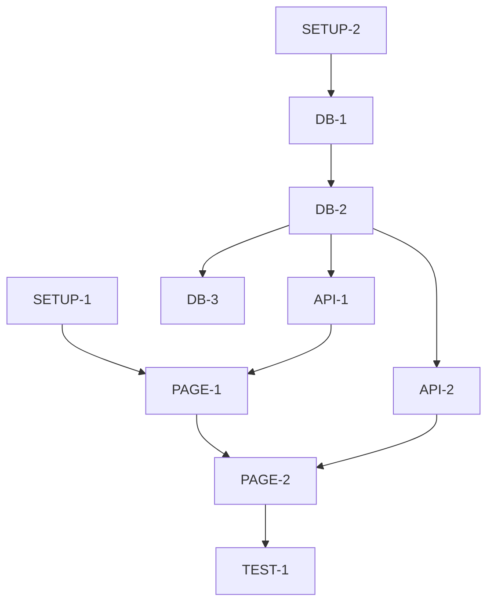

# Design to Tasks

Convert Design OS milestone instructions into granular, implementable tasks with dependencies.

## Usage

```
/design-to-tasks <section-id> [--spec <path>]
```

**Arguments:**
- `<section-id>` — The section to create tasks for
- `--spec` — Optional path to existing spec (defaults to `specs/<section-id>/spec.md`)

## Prerequisites

One of these must exist:
1. Spec file at `specs/<section-id>/spec.md` (from `/design-to-spec`)
2. Design OS milestone at `product-plan/instructions/incremental/<NN>-<section-id>.md`

If using Design OS directly without spec, also read:
- `product-plan/sections/<section-id>/types.ts`
- `product-plan/sections/<section-id>/tests.md`

## Instructions

### 1. Read Source Materials

**If spec exists:**
Read `specs/<section-id>/spec.md` for:
- Use cases → Feature tasks
- API endpoints → Backend tasks
- Data contracts → Schema tasks
- Acceptance criteria → Test tasks

**If using Design OS directly:**
Read milestone instructions for "What to Implement" sections:
- Components to copy
- Data layer requirements
- Callbacks to wire up
- Empty states to handle

### 2. Generate Task Categories

Create tasks in these categories:

#### A. Setup Tasks
```markdown
- [ ] **SETUP-1**: Copy components from Design OS export
  - Source: `product-plan/sections/<section>/components/`
  - Target: `src/components/<section>/`
  - Update imports from `@/../product/` to local paths
  - Add 'use client' directive if needed

- [ ] **SETUP-2**: Create types file
  - Source: `product-plan/sections/<section>/types.ts`
  - Target: `src/lib/types.ts` (merge with existing)
```

#### B. Database Tasks
```markdown
- [ ] **DB-1**: Create database schema
  - Define Prisma models based on types
  - Add relations between entities
  - Depends on: SETUP-2

- [ ] **DB-2**: Create migration
  - Run `prisma migrate dev`
  - Depends on: DB-1

- [ ] **DB-3**: Seed sample data
  - Source: `product-plan/sections/<section>/sample-data.json`
  - Depends on: DB-2
```

#### C. API Tasks
Extract from component props - each `on*` callback needs an endpoint:

```markdown
- [ ] **API-1**: GET /api/<resource>
  - Returns list of [Entity]
  - Include related data as specified in types
  - Depends on: DB-2

- [ ] **API-2**: POST /api/<resource>
  - Creates new [Entity]
  - Validate required fields
  - Depends on: DB-2

- [ ] **API-3**: PUT /api/<resource>/[id]
  - Updates existing [Entity]
  - Depends on: DB-2

- [ ] **API-4**: DELETE /api/<resource>/[id]
  - Soft delete or hard delete
  - Depends on: DB-2
```

#### D. Page Tasks
```markdown
- [ ] **PAGE-1**: Create <section> page
  - Wire component to API data
  - Implement loading state
  - Implement error state
  - Depends on: SETUP-1, API-1

- [ ] **PAGE-2**: Implement callbacks
  - Connect on* props to API calls
  - Add optimistic updates where appropriate
  - Depends on: PAGE-1, API-2, API-3, API-4
```

#### E. Test Tasks
Extract from `tests.md`:

```markdown
- [ ] **TEST-1**: Test <primary flow>
  - Success path
  - Failure path
  - Depends on: PAGE-2

- [ ] **TEST-2**: Test empty states
  - No data state
  - Filtered no results state
  - Depends on: PAGE-1

- [ ] **TEST-3**: Test edge cases
  - [List from tests.md edge cases section]
  - Depends on: PAGE-2
```

### 3. Link Dependencies

Create a dependency graph. Use this format:

```markdown
## Task Dependencies


```

### 4. Estimate Complexity

Tag each task with complexity:

- `[S]` — Small: < 30 min, single file change
- `[M]` — Medium: 30-60 min, multiple files
- `[L]` — Large: 1-2 hours, architectural decisions

### 5. Generate Tasks File

Create `specs/<section-id>/tasks.md`:

```markdown
# <Section> Implementation Tasks

> Generated from Design OS export
> Source: `product-plan/sections/<section-id>/`

## Overview

Total tasks: [count]
Estimated complexity: [S: x, M: y, L: z]

## Critical Path

1. SETUP-1 → SETUP-2 → DB-1 → DB-2
2. DB-2 → API-1 → PAGE-1 → PAGE-2
3. PAGE-2 → TEST-1

## Tasks

### Setup

- [ ] **SETUP-1** [S]: Copy Design OS components
  - Copy from `product-plan/sections/<section>/components/`
  - Update imports to local paths
  - Dependencies: none

- [ ] **SETUP-2** [S]: Merge types
  - Source: `product-plan/sections/<section>/types.ts`
  - Dependencies: none

### Database

- [ ] **DB-1** [M]: Create Prisma schema
  - Models: [list]
  - Relations: [list]
  - Dependencies: SETUP-2

[Continue for all categories...]

## Verification Checklist

After all tasks complete:
- [ ] All components render with real data
- [ ] All CRUD operations work
- [ ] Empty states display correctly
- [ ] Tests pass
- [ ] Matches Design OS visual design

## Notes

[Any implementation notes or decisions made during task creation]
```

### 6. Confirm Completion

Report:

```
DESIGN_TO_TASKS_COMPLETE
========================
Source: product-plan/sections/<section-id>/
Output: specs/<section-id>/tasks.md

Tasks created:
- Setup: [count]
- Database: [count]
- API: [count]
- Page: [count]
- Test: [count]
- Total: [count]

Complexity breakdown:
- Small: [count]
- Medium: [count]
- Large: [count]

Next: Run /implement <section-id> to start implementation
      Or: Run /orchestrate <section-id> to assign to specialist agents
```

## Tips

- Each callback prop (`onView`, `onEdit`, `onDelete`, `onCreate`) typically needs an API endpoint
- Group related API endpoints into single tasks if they share validation logic
- Test tasks should mirror the structure in `tests.md`
- Keep tasks small enough to complete in one session (< 2 hours)
- The critical path determines minimum implementation time
- Tasks can be parallelized if they don't share dependencies
