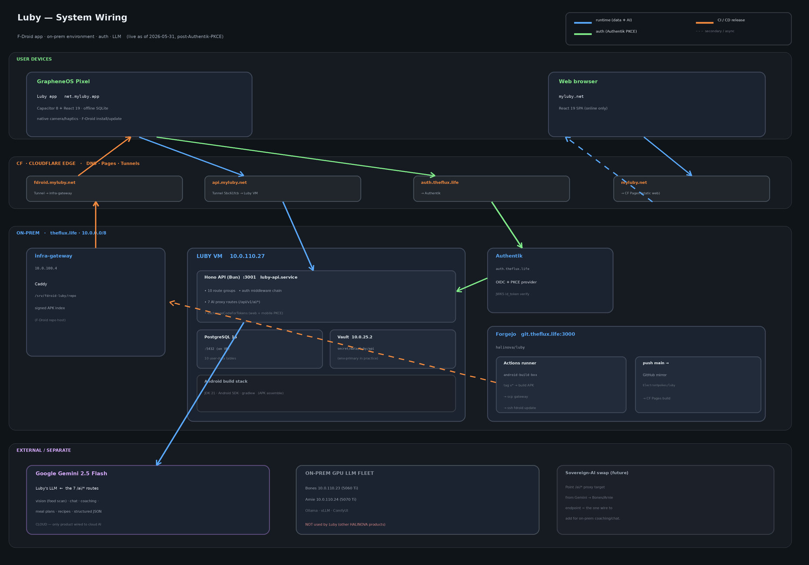
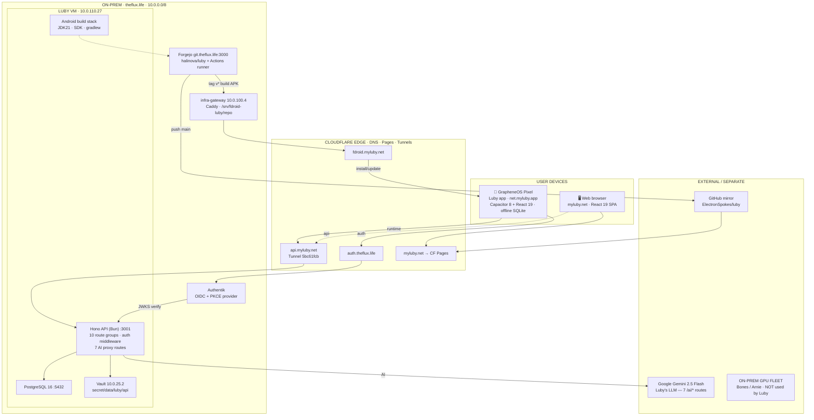

# Luby — System Diagram

*Maintained by: Scotty · Last updated: 2026-05-31 (post-Authentik-PKCE)*

Visual companion to `architecture.md`. The PNG is the rendered artifact; the Mermaid block below is the editable source of truth — keep them consistent when the wiring changes.

## The three flows

1. **Runtime (blue):** Luby app → `api.myluby.net` → CF Tunnel `5bc61fcb` → Hono API (`10.0.110.27:3001`) → PostgreSQL for data; `→ Gemini 2.5 Flash` for the 7 `/ai/*` routes. Secrets from Vault `secret/data/luby/api` (env-primary in practice).
2. **Auth (green):** app opens system browser → `auth.theflux.life` (Authentik) → `net.myluby.app://callback` deep-link → `POST /auth/mobile-callback {code, code_verifier}` → API exchanges code + JWKS-verifies id_token → 30-day Luby HS256 JWT in Capacitor Preferences. Works on GrapheneOS, no Google Play Services.
3. **CI/CD (orange):** `tag v*` → Forgejo Actions (`android-build-box`) → build signed APK → scp to infra-gateway (`10.0.100.4`) → `ssh fdroid update` → phone pulls from `fdroid.myluby.net/repo`. Separately, `push main` → GitHub mirror → CF Pages rebuilds `myluby.net`.

## LLM boundary

Luby's AI is **cloud Gemini 2.5 Flash** — it is the only household product wired to cloud AI. The on-prem GPU fleet (**Bones** `10.0.110.23`, **Arnie** `10.0.110.24`; Ollama/vLLM/ComfyUI) powers other HALINOVA products but is **not** used by Luby. Sovereign-AI swap = repoint the `/ai/*` proxy target from Gemini to a Bones/Arnie endpoint.

## Mermaid source

